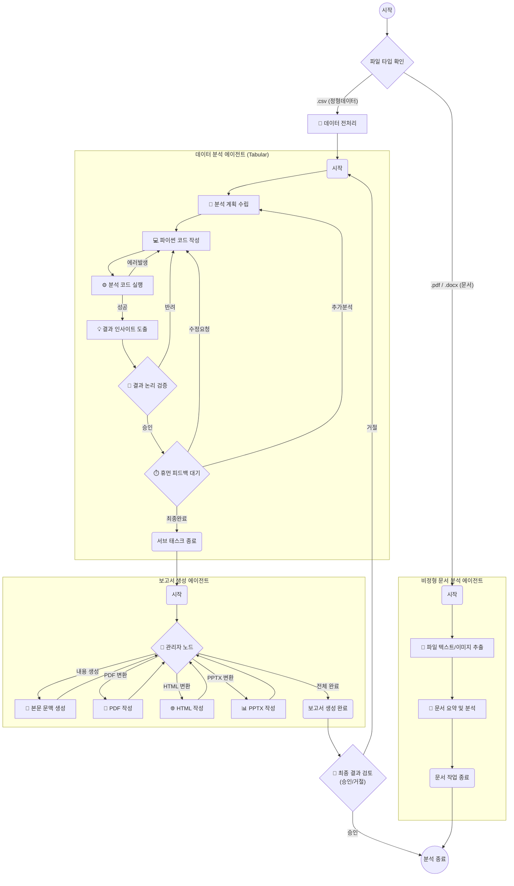

# 🤖 AIplus MultiAgent - 데이터 분석 AI (Local & Cloud)

이 저장소는 사용자가 업로드한 데이터를 분석하고, 시각화하며, 정교한 보고서를 작성해주는 **멀티 에이전트 데이터 분석 시스템**입니다.  
LangGraph를 활용하여 여러 AI 에이전트가 협업하며, 사용자는 각 작업 노드별로 최적의 LLM 모델을 자유롭게 할당할 수 있습니다.

---

## 🔗 실 사용 배포 주소 (Cloud)
배포된 환경에서 테스트하고 싶다면 아래 링크를 방문하세요.
> **[👉 앱 바로가기 (클릭)](https://auto-marketing.streamlit.app/)**  

---

## 🛠️ 상세 사용 가이드 (Local Usage Guide)

로컬 환경에서 앱을 구동(`streamlit run webapp/app.py`)하면 다음과 같은 단계를 거쳐 분석을 진행합니다.

### 1단계: [⚙️ 설정] API 키 및 기본 모델 설정
*   **API 자동 인식**: 프로젝트 루트의 `.env` 파일에 저장된 `OPENAI_API_KEY`, `GOOGLE_API_KEY`, `ANTHROPIC_API_KEY`를 자동으로 감지합니다.
*   **수동 등록 (Cloud 대응)**: API 키가 없는 환경(클라우드 등)에서는 화면에서 직접 여러 개의 API 키를 한 번에 등록할 수 있습니다.
*   **주력 모델 선택**: 전체 분석에서 기본적으로 사용할 베이스 모델을 선택하고 다음 단계로 이동합니다.

### 2단계: [🧩 매핑] 6개 노드별 모델 개별 할당
각 분석 단계의 특성에 맞춰 서로 다른 LLM을 매핑하여 효율을 극대화할 수 있습니다.
*   **🧭 계획(Plan) 노드**: 전체 분석 로직과 단계를 설계 (추론 능력이 좋은 모델 권장)
*   **💻 생성(Make) 노드**: 실제 데이터 처리용 Pandas 파이썬 코드 작성 (코딩 특화 모델 권장)
*   **⚖️ 검증(Eval) 노드**: 코드 실행 결과 및 논리적 타당성 검사 (검증 모델 권장)
*   **📄 문서(Document) 노드**: PDF/Docx 파싱 및 이미지 이해 (비전/멀티모달 모델 권장)
*   **🎭 서식(Report Style) 노드**: 결과에 최적화된 리포트 양식 분류
*   **📝 본문(Report Gen) 노드**: 최종 인사이트를 풍부한 텍스트로 전환

### 3단계: [📊 분석] 대시보드 인터페이스
*   **입력창**: 분석하고자 하는 질문과 분석 대상 파일을 업로드합니다.
*   **에이전트 상태**: 현재 어떤 에이전트가 작업을 수행 중인지 그래프로 실시간 모니터링합니다.
*   **피드백 루프**: AI가 작성한 코드나 분석 결과를 사람이 중간에 검토하고 수정 요청(Human-in-the-loop)을 보낼 수 있습니다.
*   **결과 확인**: 생성된 차트와 최종 보고서를 탭 형식으로 확인하고 다운로드합니다.

---

## 🧠 멀티 에이전트 프로세스 (Korean Workflow)

시스템 내부에서 에이전트들이 협업하는 구조입니다.



---

## 📦 기술 스택 (Tech Stack)

| 구분 | 주요 기술 |
| :--- | :--- |
| **UI / Web** | Streamlit |
| **Orchestration** | LangGraph, LangChain |
| **Data / Viz** | Pandas, Matplotlib, Seaborn, Koreanize-matplotlib |
| **Infrastructure** | Graphviz (워크플로우 시각화), Fonts-nanum |

---

## 📂 디렉토리 구조 (Directory Structure)
```
.
├── src/            
│   └── Orc_agent/   # AI 에이전트 핵심 로직 (Node, Graph, Core)
├── webapp/         
│   ├── app.py       # Streamlit 웹 애플리케이션 메인
│   └── ...
├── assets/          # 리소스 폴더
├── requirements.txt # 파이썬 패키지 의존성
├── packages.txt     # 시스템 패키지 (리눅스용 한글폰트 등)
└── README.md        # 프로젝트 설명서
```

---

## 📜 라이선스 (License)
이 프로젝트는 **MIT License**를 따릅니다. 누구나 자유롭게 사용하고 수정할 수 있습니다.
