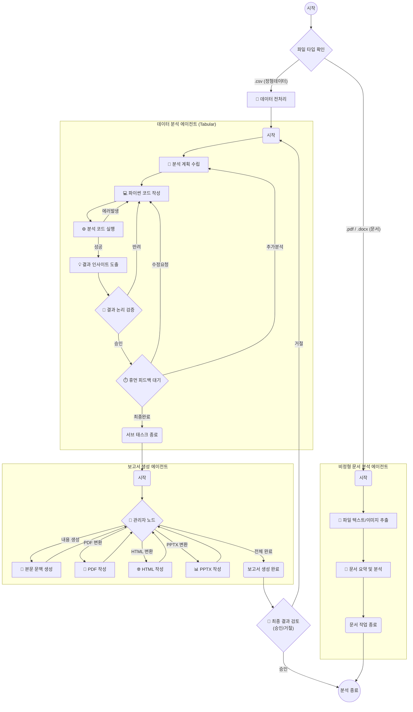

# 🤖 AIplus MultiAgent - 데이터 분석 AI (Local & Cloud)

이 저장소는 사용자가 업로드한 데이터를 분석하고, 시각화하며, 정교한 보고서를 작성해주는 **멀티 에이전트 데이터 분석 시스템**입니다.  
LangGraph를 활용하여 여러 AI 에이전트가 협업하며, 사용자는 각 작업 노드별로 최적의 LLM 모델을 자유롭게 할당할 수 있습니다.

---

## 🔗 실 사용 배포 주소 (Cloud)
배포된 환경에서 테스트하고 싶다면 아래 링크를 방문하세요.
> **[👉 앱 바로가기 (클릭)](https://auto-marketing.streamlit.app/)**  

---

## 🛠️ 상세 사용 가이드 (Local Usage Guide)

로컬 환경에서 앱을 구동(`streamlit run webapp/app.py`)하면 다음과 같은 단계를 거쳐 분석을 진행합니다.

### 1단계: [⚙️ 설정] API 키 등록
*   **API 자동 인식**: 프로젝트 루트의 `.env` 파일에 저장된 API 키들을 자동으로 감지합니다.
*   **수동 등록**: API 키가 없는 환경에서는 화면에서 직접 Google, OpenAI, Anthropic 키를 한 번에 등록하여 세션 동안 유지할 수 있습니다.

### 2단계: [🧩 매핑] 스마트 모델 프리셋 및 개별 할당

각 분석 단계의 특성에 맞춰 서로 다른 LLM을 매핑하여 효율을 극대화할 수 있습니다.
*   **🧭 계획(Plan) 노드**: 전체 분석 로직과 단계를 설계 (추론 능력이 좋은 모델 권장)
*   **💻 생성(Make) 노드**: 실제 데이터 처리용 Pandas 파이썬 코드 작성 (코딩 특화 모델 권장)
*   **⚖️ 검증(Eval) 노드**: 코드 실행 결과 및 논리적 타당성 검사 (검증 모델 권장)
*   **📄 문서(Document) 노드**: PDF/Docx 파싱 및 이미지 이해 (비전/멀티모달 모델 권장)
*   **🎭 서식(Report Style) 노드**: 결과에 최적화된 리포트 양식 분류
*   **📝 본문(Report Gen) 노드**: 최종 인사이트를 풍부한 텍스트로 전환

#### 🚀 빠른 모델 추천 프리셋 (Quick Presets)
일일이 설정할 필요 없이 버튼 클릭 한 번으로 최적의 조합을 완성합니다:
- **✨ OpenAI 최적**: 코딩은 `gpt-5.1`, 기획은 `gpt-4o` 등 OpenAI 내 최적 모델 자동 분배
- **🎭 Anthropic 최적**: 모든 노드에 `Claude 4.6 Sonnet` 혹은 `Haiku` 최신 버전 매핑
- **💎 Google 최적**: `Gemini 2.5`와 `Gemini 3`를 노드 역할에 맞춰 조합
- **🌈 혼합 추천 (Mixed)**: 제조사 상관없이 분야별 최강 모델 교차 매핑 (1순위/2순위 우선순위 로직 포함)

> [!NOTE]
> **보안 및 제약**: API 키가 등록되지 않은 제공자의 버튼은 자동으로 비활성화(Disabled)됩니다. 특히 `Mixed(혼합)` 버튼은 2개 이상의 API 키가 등록되어야 활성화됩니다.

#### 🔍 지능형 모델 검색 엔진 (Smart Search)
모델 선택 시 다음의 정교한 매핑 로직이 작동합니다:
1. **정확한 일치(Exact Match)**: 지정된 키워드와 모델명이 100% 일치하는 것을 최우선으로 선택합니다.
2. **유사도 검색(Fuzzy Match)**: 정확한 이름이 없을 경우에만 모델명에 키워드가 포함된 유사 모델을 찾습니다.
3. **우선순위 폴백(Priority Fallback)**: 특정 제조사 모델을 사용할 수 없는 경우, 사전에 정의된 2순위 제조사 모델로 자동 대체합니다.

### 3단계: [📊 분석] 대시보드 인터페이스
*   **입력창**: 분석하고자 하는 질문과 분석 대상 파일을 업로드합니다.
*   **에이전트 상태**: 현재 어떤 에이전트가 작업을 수행 중인지 그래프로 실시간 모니터링합니다.
*   **피드백 루프**: AI가 작성한 코드나 분석 결과를 사람이 중간에 검토하고 수정 요청(Human-in-the-loop)을 보낼 수 있습니다.
*   **결과 확인**: 생성된 차트와 최종 보고서를 탭 형식으로 확인하고 다운로드합니다.

---

## 🧠 멀티 에이전트 프로세스 (Korean Workflow)

시스템 내부에서 에이전트들이 협업하는 구조입니다.



---

## 📦 기술 스택 (Tech Stack)

| 구분 | 주요 기술 |
| :--- | :--- |
| **UI / Web** | Streamlit |
| **Orchestration** | LangGraph, LangChain |
| **Data / Viz** | Pandas, Matplotlib, Seaborn, Koreanize-matplotlib |
| **Infrastructure** | Graphviz (워크플로우 시각화), Fonts-nanum |

---

## 📂 디렉토리 구조 (Directory Structure)
```
.
├── src/            
│   └── Orc_agent/           # AI 에이전트 핵심 로직
│       ├── Graph/           # LangGraph 워크플로우 정의 (Main, Sub)
│       ├── Node/            # 각 단계별 실행 노드 (Main, Sub)
│       ├── State/           # 에이전트 상태(State) 정의
│       └── core/            # LLM 팩토리, 관측(Observe), 공통 유틸리티
├── webapp/         
│   ├── app.py               # Streamlit 웹 앱 메인
│   └── graph_visualizer.py  # 그래프 시각화 유틸리티
├── assets/                  # 이미지 및 리소스
├── logs/                    # 실행 로그 저장
├── output/                  # 생성된 보고서 및 결과물 저장
├── requirements.txt         # 파이썬 패키지 의존성
└── README.md                # 프로젝트 설명서
```

---

## 📜 라이선스 (License)
이 프로젝트는 **MIT License**를 따릅니다. 누구나 자유롭게 사용하고 수정할 수 있습니다.
